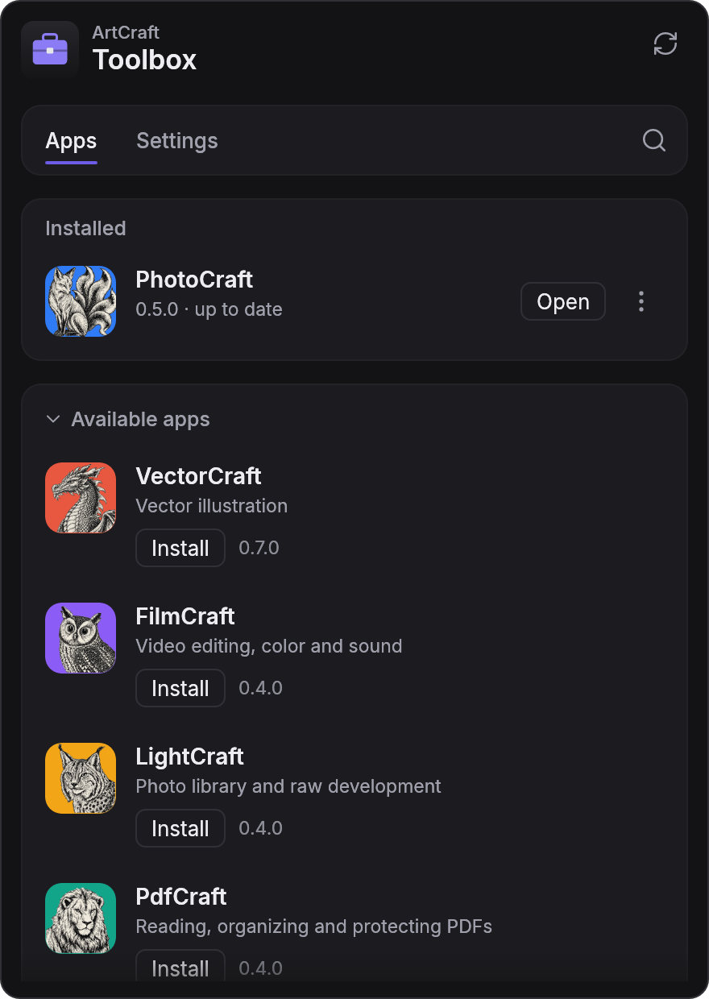
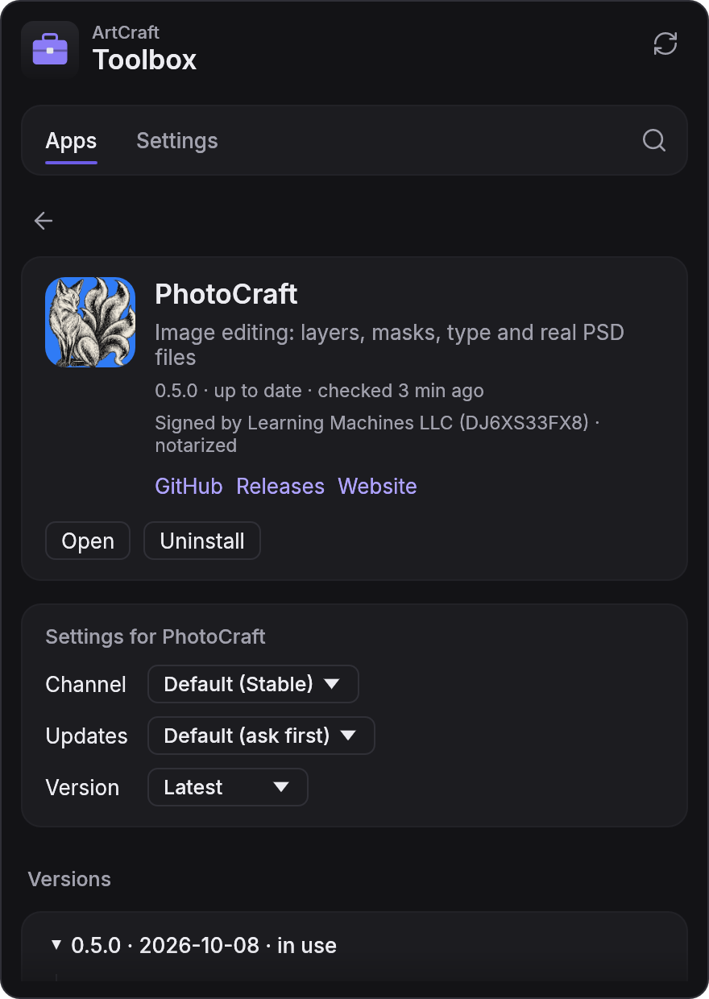
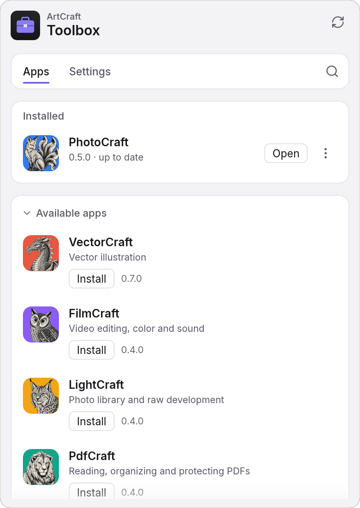
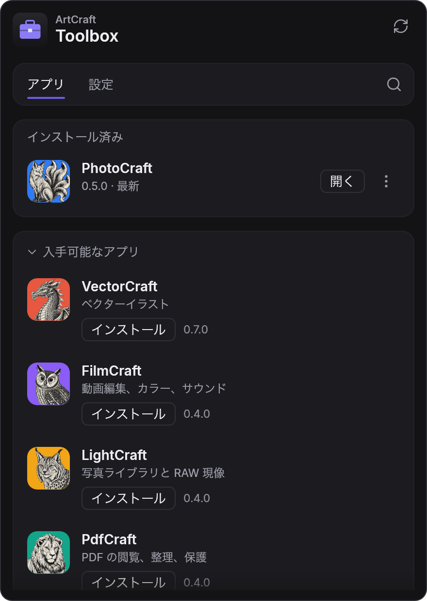

<h1 align="center">ArtCraft Toolbox</h1>

<p align="center">
  <b>One app to install, update and launch every Crafting App.</b><br>
  A suite manager for the <a href="https://getartcraft.com/apps">ArtCraft Crafting Apps</a>, in pure Rust.
</p>

<p align="center">
  
  
  
  
</p>

> [!NOTE]
> **Pre-alpha.** Milestones M0 to M4 and M8 are done: the toolbox lives in the menu bar or tray,
> checks GitHub for every app's releases in the background, and installs, updates (on request or
> automatically), rolls back, opens and uninstalls any craft, checking each version's checksum and
> platform signature first. It opens as a popover from the menu bar or tray, in 15 languages and a
> dark or light theme. It isn't packaged for download yet (M5); see [the roadmap](docs/roadmap.md).

## Screenshots

<table>
  <tr>
    <td width="50%" valign="top">
      
      <br><sub>Installed apps first, then everything you can install. Click the menu-bar icon to open it.</sub>
    </td>
    <td width="50%" valign="top">
      
      <br><sub>Each app's page: its signature, its own update settings and every version, with release notes.</sub>
    </td>
  </tr>
  <tr>
    <td width="50%" valign="top">
      
      <br><sub>Light or dark, or the same as the system.</sub>
    </td>
    <td width="50%" valign="top">
      
      <br><sub>In 15 languages, switched without a restart.</sub>
    </td>
  </tr>
</table>

Every screenshot is the real app, rendered offscreen by its snapshot example from a real data
folder (PhotoCraft installed by the toolbox); see [docs/development.md](docs/development.md).

## What it manages

| App | What it's for | Code |
|---|---|---|
| **PhotoCraft** | Image editing: layers, masks, type and real PSD files | [storytold/photocraft](https://github.com/storytold/photocraft) |
| **VectorCraft** | Vector illustration | [storytold/vectorcraft](https://github.com/storytold/vectorcraft) |
| **FilmCraft** | Video editing, color and sound | [storytold/filmcraft](https://github.com/storytold/filmcraft) |
| **LightCraft** | Photo library and raw development | [storytold/lightcraft](https://github.com/storytold/lightcraft) |
| **PdfCraft** | Reading, organizing and protecting PDFs | [storytold/pdfcraft](https://github.com/storytold/pdfcraft) |
| **EffectCraft** | Motion graphics and visual effects | [storytold/effectcraft](https://github.com/storytold/effectcraft) |
| **DesignCraft** | Page layout and publishing | [storytold/designcraft](https://github.com/storytold/designcraft) |
| **CADCraft** | Computer-aided design and drafting | [storytold/cadcraft](https://github.com/storytold/cadcraft) |
| **DeckCraft** | Presentations and slide shows | [storytold/deckcraft](https://github.com/storytold/deckcraft) |
| **GridCraft** | Spreadsheets | [storytold/gridcraft](https://github.com/storytold/gridcraft) |
| **SoundCraft** | Audio recording, editing and mixing | [storytold/soundcraft](https://github.com/storytold/soundcraft) |
| **WordCraft** | Word processing | [storytold/wordcraft](https://github.com/storytold/wordcraft) |

The list is data ([`crates/catalog/catalog.toml`](crates/catalog/catalog.toml)): adding a craft
that follows the [release contract](docs/release-contract.md) needs no code.

## How it works

Every Crafting App publishes its releases the same way: GitHub Releases tagged `v<version>`,
assets named `<app>-<version>-<os>-<arch>.<ext>`, and a `SHA256SUMS.txt`. The toolbox reads those
feeds, picks the right per-user package for your machine (DMG on macOS, the portable zip on
Windows, the AppImage on Linux), verifies it, installs it side by side with the previous version
so you can roll back, and keeps it up to date. `cargo xtask contract` checks every craft's latest
release against that contract; on 2026-10-09 all twelve pass.

## Get started

```sh
cargo run --release -p artcraft-toolbox            # the desktop app
cargo run -p artcraft-toolbox-cli -- list          # the catalog, headless
cargo run -p artcraft-toolbox-cli -- check         # check GitHub for new releases
cargo run -p artcraft-toolbox-cli -- install photocraft   # download, verify, install
cargo run -p artcraft-toolbox-cli -- update --all         # update everything, keeping the old versions
cargo run -p artcraft-toolbox-cli -- status \
  --feed photocraft=crates/feed/tests/fixtures/photocraft-releases.json
cargo xtask ci                                     # fmt, clippy, tests, layering
```

Rust 1.95+. On Linux: `libxkbcommon-dev libwayland-dev libx11-dev libxrandr-dev libxi-dev libgl1-mesa-dev libgtk-3-dev`.

## Under the hood

Built exactly like [PhotoCraft](https://github.com/storytold/photocraft): a Cargo workspace of
layered crates (enforced by `cargo xtask layers`), native egui/eframe on wgpu, no webview, no
JavaScript, and an engine where every action is a command, so the UI, the CLI and agents all
drive the same code. Non-test code never panics.

| Read | |
|---|---|
| [AGENTS.md](AGENTS.md) | Rules for contributors and AI agents: start here |
| [docs/architecture.md](docs/architecture.md) | Crates, layers, data flow, install layout |
| [docs/release-contract.md](docs/release-contract.md) | What the toolbox relies on from every craft |
| [docs/development.md](docs/development.md) | Build, test, CLI, UI snapshots |
| [docs/roadmap.md](docs/roadmap.md) | Milestones and current focus |
| [SECURITY.md](SECURITY.md) | Threat model and reporting |

## License

MIT OR Apache-2.0, at your option ([LICENSE-MIT](LICENSE-MIT), [LICENSE-APACHE](LICENSE-APACHE),
[NOTICE](NOTICE)). ArtCraft and the Crafting App names are trademarks of the ArtCraft Team, used
here to name the apps the toolbox installs; no ArtCraft logo is bundled.
